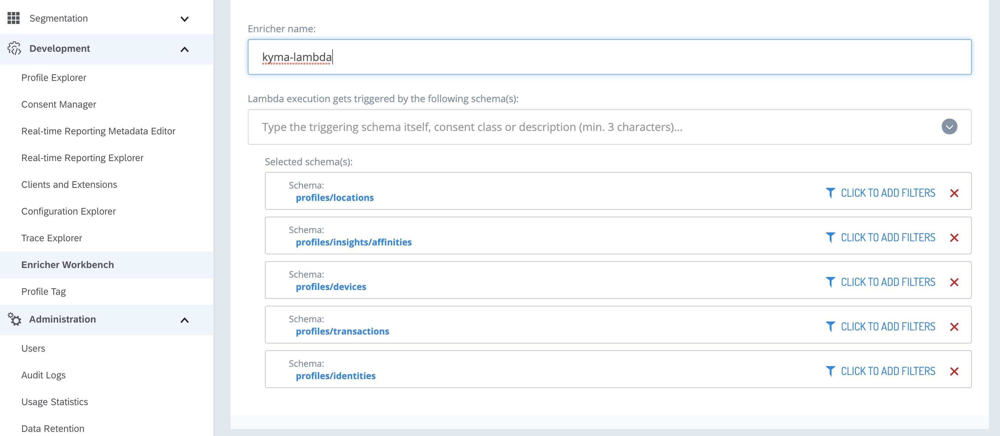

The SAP Context-Driven Services(CDS) Connector allows you to integrate a CDS tenant by registering its APIs.  The integration uses the [extensibility features](https://help.sap.com/viewer/0815bc232f5140bba54a58ab15c82e99/Current/en-US/9ed15aa6eac34b948693955da0c90174.html) available in the SAP C/4HANA cockpit based on concepts and solutions from the open-source project "Kyma", so that you can easily develop Side-by-Side extensions. 

> **NOTE**: The integration is possible in the **preview** mode only. Do not use it in production scenarios.

### Set up the SAP Context-Driven Services Connector

### Pre-requiste

1. Goto your SAP Context-Driven Services tenant , goto **Clients and extensions** and click on **Create client**. Copy the Client ID and Client secret.

### Setup

1. Navigate to the **Runtimes** view under **Extensibility** in SAP C/4HANA cockpit and click on the cluster that you will be using

2. Register a new system providing an appropriate name (e.g. 'cds')

3. Click **Kyma Console**.

4. In the Console, choose the Namespace, go to **Catalog** and select **[Preview] SAP Context-Driven Services - Connector**.

5. Click **Add once** to install and configure the SAP Context-Driven Services Connector:

    | Parameter | Description |
    | --- | --- |
    | **Application Name** | The name of the registered system from step 2.|
    | **Cluster Domain**   | The domain of the Kyma cluster. For example, `demo.cluster.extend.cx.cloud.sap` |
    | **Formparameters**   | Client credentials in this format: client_id=yourclientId,grant_type=client_credentials,client_secret=yoursecret |
    | **System URL**       | The URL of your CDS tenant. For example `https://api.us.context.cloud.sap` |
    | **OAuth URL**        | The url of the OAuth server of the SAP CDS Tenant. `https://htp741143850.api.us.context.cloud.sap/uaa/oauth/token` |

### Set up the SAP Context-Driven Services tenant

### Pre-requiste

1. Goto Kyma Console, Choose Namespace, go to **Lambdas** , open lambda **cds-events**, hover on the http icon next to **Select function Trigger** and copy the URL. We will provide this URL to a lambda running in CDS enricher workbench.

### CDS Setup

1. Open the **Enricher workbench** in your CDS tenant.

2. Create a new lambda and give it a suitable name.

3. In the **Enricher configuration**, as depicted in the image- choose the right schemas.

4. Copy the lambda code from [link](https://raw.githubusercontent.com/SAP-samples/xf-addons/master/addons/cds-connector-0.0.1/lambda/cds-lambda.js) and use it as code for lambda created in step 2.

5. In the lambda code, search for variable **endpointURL** and give the value of the url of lambda copied earlier.