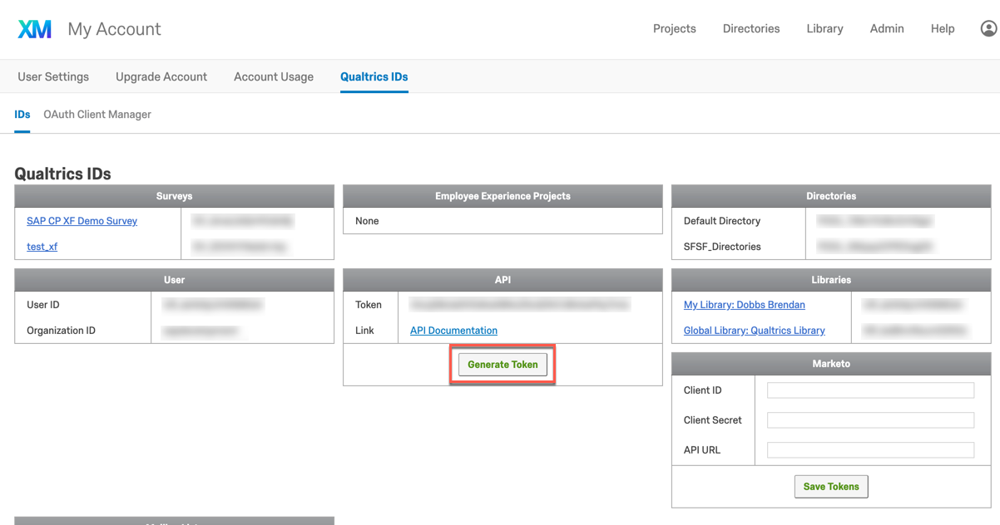

## Overview

The SAP Qualtrics Connector allows you to integrate an SAP Qualtrics tenant by registering its APIs and Events and providing an event bridge that publishes [webhook events](https://api.qualtrics.com/docs/webhooks) from SAP Qualtrics to the Kyma event bus. The integration uses the [extensibility features](https://help.sap.com/viewer/0815bc232f5140bba54a58ab15c82e99/Current/en-US/9ed15aa6eac34b948693955da0c90174.html) available in the SAP C/4HANA cockpit based on concepts and solutions from the open-source project "Kyma", so that you can easily develop Side-by-Side extensions. 

> **NOTE**: The integration is possible in the **preview** mode only. Do not use it in production scenarios.

## Retrieve API key

The SAP Qualtrics Connector using [API Key Authentication](https://api.qualtrics.com/docs/api-key-authentication). 

1. Login to your SAP Qualtrics tenant
2. Go to **My Account** > **General Settings** > **Qualtrics ID**
3. If there is no API token already generated then generate a new one
4. Copy the API token

### Set up the SAP Qualtrics Connector 

1. Navigate to the **Runtimes** view under **Extensibility** in SAP C/4HANA cockpit and click on the cluster that you will be using
2. Register a new system providing an appropriate name (e.g. 'sap-qualtrics')
3. Click **Kyma Console**.
4. In the Console, choose the Namespace, go to **Catalog** and select **[Preview] SAP Qualtrics - Connector**.
5. Click **Add once** to install and configure the SAP Cloud for Customer Connector:

    Parameter | Description |
    |---|---|
    |**API Key**|The SAP Qualtrics API Key that was retrieved in the first step|
    |**Application Name**   |The name of the registered system from step 2.|
    |**Cluster Domain**|The domain of the Kyma cluster. For example, `demo.cluster.extend.cx.cloud.sap`|
    |**Qualtrics URL**|The URL of your SAP Quantrics tenant. For example `https://xxxx.xxx.qualtrics.com`|
