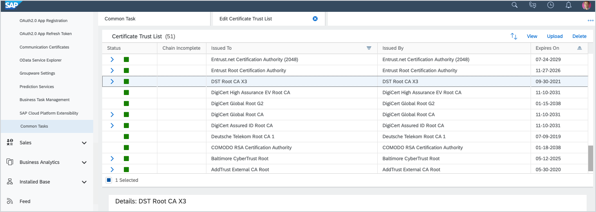
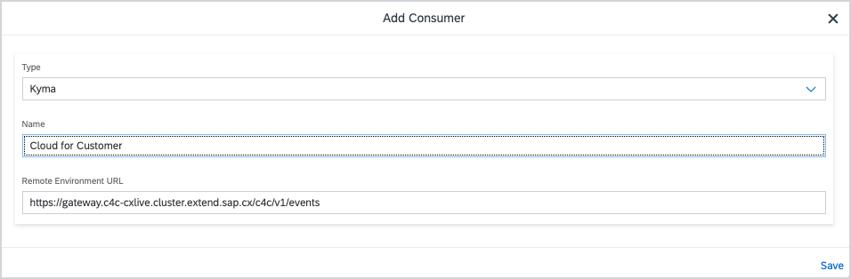
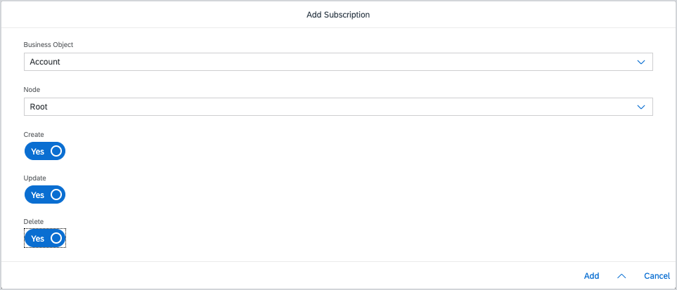

# SAP Cloud for Customer Connector

## Overview

The SAP Cloud for Customer Connector allows you to integrate an SAP Cloud for Customer instance by registering its ODATA services and Event catalog in an existing Application and activating Event sending. The integration uses the [extensibility features](https://help.sap.com/viewer/dbce7cc5e9e3469c84849d35e777fe0b/2019-05-07/en-US/363cf54bad2c47aeb44a87c215ad91ea.html) available in the SAP C/4HANA cockpit based on concepts and solutions from the open-source project "Kyma", so that you can easily develop Side-by-Side extensions. 

> **NOTE**: The integration is possible in the **preview** mode only. Do not use it in production scenarios.

## Prerequisites
* SAP Cloud for Customer version 1902 
* "Kyma" version 1.0 or higher
* [DST Root Certificate](https://www.identrust.com/dst-root-ca-x3)

## Scenario 

To establish the connection and allow data exchange between SAP Cloud for Customer and "Kyma", perform the following steps using SAP Cloud for Customer, SAP C/4HANA cockpit and Kyma Console.

1. Configure trust settings in SAP Cloud for Customer.
2. Configure Event notification in SAP Cloud for Customer.
3. Expose APIs in SAP Cloud for Customer and create credentials.
4. Set up the SAP Cloud for Customer Connector to register APIs in "Kyma".

### Configure trust settings

1. Log in to SAP Cloud for Customer frontend.
2. Go to **Administrator** > **Common Tasks** > **Edit Certificate Trust List**.
3. Upload the DST Root Certificate and make sure it appears on the list.

### Configure event notification

1. In the SAP Cloud for Customer frontend, go to **Administrator** > **General Settings** > **System Administration** > **Event Notification**.
2. Click **Add**.
3. Select consumer type, and then enter a Name and an Endpoint.

4. **Edit** the consumer and click **Edit Credentials to enter authentication details.
5. Go to **Subscriptions** > **Add**.
6. Select a Business Object and Node and then select at least one of Create, Update, or Delete.

7. Click **Add**.
8. Select the consumer and go to **Actions** > **Activate**.

### Expose APIs

### Set up the SAP Cloud for Customer Connector 

1. Navigate to the **Runtimes** view under **Extensibility** in SAP C/4HANA cockpit. If you need to provision the runtime, follow [these instructions](https://help.sap.com/viewer/dbce7cc5e9e3469c84849d35e777fe0b/2019-05-07/en-US/0bb50b27d76d4113ac32655f31777662.html).
3. Click **Kyma Console**.
4. In the Console, choose the Namespace, go to **Service Catalog** and select the SAP Cloud for Customer Connector.
5. Install and configure the SAP Cloud for Customer Connector:

    Parameter | Description |
    |---|---|
    |**System URL**|The base URL of the SAP Cloud for Customer instance. For example, `https://c4c.instance.sap.com` |
    |**Basic Auth Username** ||
    |**Basic Auth Password** ||
    |**Application Name**   |The name of the Application CR where the ODATA services and the event catalog should be registered for consumption|