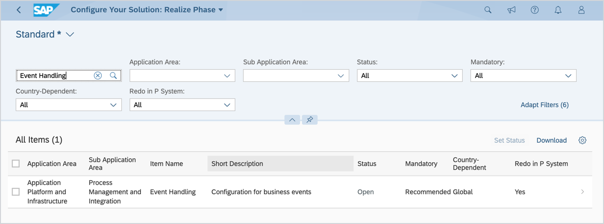
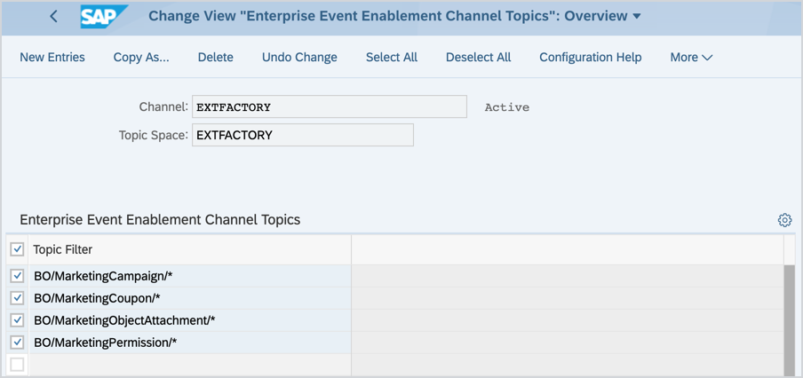

# SAP Marketing Connector

## Overview

Establishing the connection between SAP Marketing Cloud and the SAP Cloud Platform Extension Factory allows you to develop Side-by-Side extensions. The SAP Marketing Connector facilitates a simple and secure way of pairing the marketing solution with the Extension Factory which in turn leverages registering APIs and Events. 

## Prerequisites
* SAP Marketing Cloud version 1905 or higher
* SAP Cloud Platform Extension Factory version 0.8 or higher

## Scenario 

To establish the connection and allow data exchange between SAP Marketing Cloud and SAP Cloud Platform Extension Factory, perform the following steps using both systems. 

1. [Create and configure a Communication User](#create-a-communication-user).
2. [Create a Communication System](#create-a-communication-system) which is the external system to be integrated with the marketing solution. With the Communication System in place, SAP Marketing Cloud is able to send Events to SAP Cloud Platform Extension Factory. 
3. [Create Communication Arrangements](#create-communication-arrangements) which help you to organize the data exchange between the external system and the marketing system. You need to set them up for all APIs you want to register in the SAP Cloud Platform Extension Factory.
4. Use the SAP Cloud Extension Factory to [set up the SAP Marketing Connector](#set-up-the-sap-cloud-marketing-connector).
5. [Configure Business Events handling](#configure-business-events-handling) using the SAP_COM_0092 communication scenario for Enterprise Messaging Integration.

### Create a Communication User

1. Log in to the SAP Marketing Cloud frontend using the **SAP_BR_ADMINISTRATOR** role. Use the following credentials:
    * **User**: `Administrator`
    * **Password**: `Welcome1!`
2. Go to **Communication Management** > **Maintain Communication Users**.
3. Click **New**.
4. Enter the **User Name**, **Description**, and **Password**.

5. Confirm with **Create**.

### Create a Communication System

1. Go to **Communication Management** > **Maintain Communication Systems**.
2. Click **New**.
3. Provide the **System ID**. It is the ID of the external system you want to connect to. Confirm with **Create**.
4. Configure the system by entering the following parameters:

    | Parameter    | Value |
    | --- | ---|
    | **Host Name**   | `event-bridge.<cluster_url>` |
    | **HTTPS Port**    | `443 `|
    | **Auth. Endpoint**| `https://mkt-oauth2-server/oauth/authorize`|
    | **Token Endpoint**| `https://mkt-oauth2-server/authorizationserver/oauth/token` |
    | **Inbound User** | `EXTFACTORY`   |
    | **Outbound User** |  Authentication Method: `OAuth 2.0`  OAuth 2.0 Client ID: `kyma`   Client Secret: `kyma123` |
    

### Create Communication Arrangements

When creating a Communication Arrangement, you need to create a Communication Scenario. This scenario bundles inbound and outbound communication APIs and is the basis for communication between different systems. Each communication arrangement is based on a communication scenario.

Here are the Communication Scenarios for you to use:

* SAP_COM_0207 - Interaction Contact Integration
* SAP_COM_0204 - Marketing Campaigns Integration
* SAP_COM_0206 - Marketing Interaction Integration
* SAP_COM_0171 - Marketing Product Integration
* SAP_COM_0171 - Marketing Product Integration
* SAP_COM_0300 - Marketing External Recommendations Service
* SAP_COM_0003 - Marketing Master Data Integration
* SAP_COM_0306 - Marketing - Offers

Follow these steps to create Communication Arrangements:

1. Go to **Communication Management** > **Maintain Communication Arrangements**.
2. Click **New**.
3. Enter the **Scenario** code. The **Arrangement Name** is filled in automatically, but you can change it at any time. Confirm with **Create**.
3. Enter the parameters:
    |Parameter | Value|
    |---|---|
    |**Communication System**|`EXTFACTORY` |
    |**User Name** |`EXTFACTORY`|

5. Save the configuration.

Establishing this Communication Arrangement allows registering the services listed under **Inbound Services** in the SAP Cloud Platform Extension Factory. 

### Set up the SAP Marketing Connector

1. Log in to the SAP Cloud Platform Extension Factory.
2. Go to **Integration** > **Applications** and create a new Application (if it does not exist yet).
3. Go to **Service Catalog** > **Marketing Connector**.
4. Install and configure the SAP Marketing Connector:

    Parameter | Description |
    |---|---|
    |**System URL**|The base URL of the SAP Marketing Cloud instance you want to register. For example, `https://marketing.instance.sap.com` |
    |**Basic Auth Username** |The username for the Communication User in SAP Marketing Cloud. This is the Communication User that you have created in the [first step](#create-communication-user). It must already exist in SAP Marketing Cloud and be used for all of the Communication Arrangements (used to expose APIs) you want to register in the Extension Factory|
    |**Basic Auth Password** |The password for the Communication User in SAP Marketing Cloud|
    |**OAuth2 client_id**    |The OAuth 2.0 Client ID for sending the MQTT events. The OAuth 2.0 credentials are required to configure the Communication Scenario|
    |**OAuth2 client_secret**| The OAuth 2.0 Client Secret for sending the MTTQ events |
    |**Application Name**   |The name of the Application CR where the ODATA services and the event catalog should be registered for consumption|
    |**Cluster Domain** |The domain of the cluster. For example, `demo.kyma.cx`|

4. Go to SAP Cloud Platform Extension Factory to view Events and APIs that have been registered for the Application.

### Configure Business Events handling

1. Log in to the SAP Marketing Cloud frontend.
1. Go to **Communication Management** > **Maintain Communication Arrangement**.
2. Create a new Communication Arrangement for Scenario SAP_COM_0092 (Enterprise Eventing Integration) using the following parameters:

    |Parameter| Value|
    |---|---|
    |Communication System|`EXTFACTORY`|
    |Channel             |`EXTFACTORY`|
    |Topic Space         |`EXTFACTORY`|

    
3. Log in to SAP Marketing Cloud with a user that has the **SAP_BR_BPC_EXPERT** role.
4. Go to **Implementation Cockpit** > **Manage Your Solution** > **Configure Your Solution**.
5. Search for **Event Handling** and select the entry.

6. Go to **Configuration Steps** > **Maintain Event Topics** and click **Configure**.
7. Determine the Working Area. Set **Channel** to `EXTFACTORY` and confirm.
8. Select all the Marketing Business Events.

9. Log in to SAP Marketing Cloud with a user that has the **SAP_BR_ADMINISTRATOR** role.
10. Go to **Business Event Handling** > **Business Event Subscription** and search for the Enterprise Eventing subscription.
11. Activate all Events.

The connection is set up. Business Events triggered in SAP Marketing Cloud will be sent to the SAP Cloud Platform Extension Factory.
