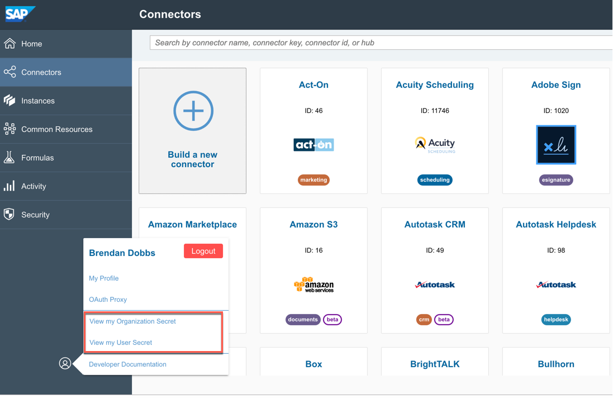

# SAP Open Connectors Connector

## Overview

This connector allows you to use the connectors provided by SAP Cloud Platform Open Connectors to connect to 150+ cloud applications.

> **NOTE**: The integration is possible in the **preview** mode only. Do not use it in production scenarios.

## Prerequisites
* Open Connectors Account 
* "Kyma" version 1.3 or higher

### 1. Create a SAP Cloud Platform Open Connectors Account

If you don't have an existing account to use then you can register for a trial account by following the steps in this [blog](https://blogs.sap.com/2018/09/19/part-1-enable-sap-cloud-platform-open-connectors-in-trial/).

### 2. Install the Connector 

The connector consists of the following addons:

* **SAP Cloud Platform Open Connectors - Connector** - provides the connector itself and the required resource definitions
* **SAP Cloud Platform Open Connectors - Account** - configures the connection for a specific account, registering the configured cloud application Connector Instances in Kyma

Note: The connector addon must to be installed before configuring an account.

1. Navigate to the Kyma console
2. In the Console, choose a Namespace, go to **Service Catalog** and select  **SAP Open Connectors Connector - Connector**.
3. Click **Add once** to install the connector

### 3. Retrieve Credentials
1. Navigate to to the SAP Cloud Platform Open Connectors Cockpit
2. Click on the profile action and copy the organization and user secrets

  

### 4. Configure Account 
1. Navigate to the Kyma console
2. In the Console, choose a Namespace, go to **Service Catalog** and select **SAP Open Connectors Connector - Account**.
3. Click **Add** to configure an account, providing the following parameters: 

    | Parameter    | Value |
    | --- | ---|
    | **Open Connectors Host Name**   | The host name (without 'https') of you SAP Cloud Platform Open Connectors instance |
    | **Organization Secret**| The value retrieved above in 'Retrieve Credentials' |
    | **User Secret**| The value retrieved above in 'Retrieve Credentials' |
     
### 5. Registering a Connector Instance (from Open Connectors)
1. Create a new Connector Instance in the SAP Cloud Platform Open Connectors Cockpit, see this (example)[https://blogs.sap.com/2018/09/28/part-8-simplify-connectivity-to-third-party-collaboration-application-slack-from-sap-cloud-platform-open-connectors/]
2. Navigate to the Kyma console and go to **Integration** > **Applications** 
3. Open the Application created by the connector
4. An API should be visible under **Provided Services & Events** for the Connector Instance that was created
5. Bind the Application to a Namespace to make the API visible in the Service Catalog for this Namespace  
